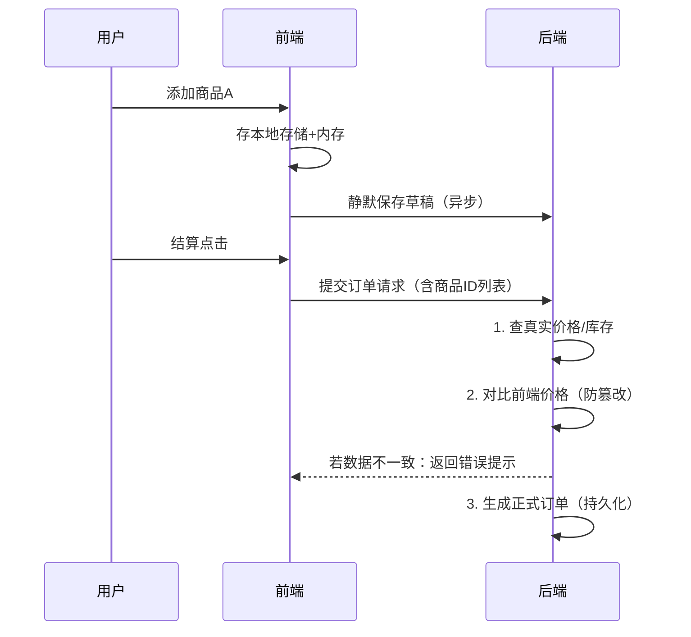

## 问：前后端分离项目中一些数据保存到底是前端来做还是后端来做呢

在前后端分离架构中，数据保存职责的划分遵循 **“业务数据后端存，临时状态前端存”** 的核心原则。具体如何划分取决于**数据的性质、安全性要求、持久性需求**以及**谁需要访问**这些数据。以下是详细分析：

---

### **一、必须由后端保存的数据（核心原则）**
1. **需要持久化存储的业务数据**  
   * **所有需要长期保存、跨会话/设备访问的数据**：用户信息、订单、文章、交易记录、商品库存等。
   * **涉及业务逻辑或安全的数据**：账户余额、权限设置、敏感配置等（前端存储易被篡改）。
   * **需要多用户共享或协作的数据**：如多人编辑的文档、实时聊天记录。

2. **需严格验证或处理的数据**  
   * 表单提交（如注册、支付）必须由后端验证并存储，前端验证仅用于体验优化（可绕过）。
   * 涉及数据库操作、事务处理的数据（如订单创建）。

3. **敏感数据**  
   * 用户密码（必须加密存储）、身份证号、银行卡号等（**禁止**前端存储）。

---

### **二、适合前端保存的数据（临时/非关键数据）**
1. **UI状态与临时交互数据**  
   * 表单草稿、未提交的输入（如 `localStorage` 缓存草稿）。
   * 页面组件的折叠/展开状态、选项卡激活状态。
   * 排序、筛选条件（如表格的列排序规则）。

2. **提升用户体验的缓存**  
   * 频繁访问的**静态数据**（如城市列表、分类目录），可存于 `localStorage` 或 `sessionStorage`（需设置过期机制）。
   * 已加载的列表数据（配合后端分页，前端缓存当前页）。

3. **用户个性化设置**  
   * 主题颜色、语言偏好、布局设置（可先存前端，再异步同步到后端）。

4. **降低后端压力的非关键数据**  
   * 如用户最近浏览的商品ID（用于“历史记录”展示），可先存前端，重要场景再同步到后端。

---

### **三、典型场景对比
| **场景**             | **存储位置** | **原因**                                                     |
| -------------------- | ------------ | ------------------------------------------------------------ |
| 用户登录凭证 (Token) | 前端         | 存于 `Cookie` 或 `localStorage`，每次请求携带（后端不存储Token本身）。 |
| 购物车商品列表       | 双端         | 前端存未提交的临时数据，用户结算时提交后端生成订单。         |
| 文章内容             | 后端         | 需持久化、多设备访问的核心业务数据。                         |
| 表格分页和排序参数   | 前端         | UI交互状态，刷新后通常重置。                                 |
| 用户个人资料头像     | 后端         | 需永久存储并共享的资源（前端可缓存图片优化加载速度）。       |

---

### **四、注意事项**
1. **前端存储不可信任**  
   * 所有来自前端的数据（包括 `localStorage`、URL参数）必须由后端**重新验证**（防止篡改）。
2. **敏感信息禁止前端存储**  
   * 即使加密也不安全（密钥可能泄露），JWT Token应设为短期有效。
3. **同步策略**  
   * 前端保存的用户设置（如主题），需提供机制同步到后端（避免换设备丢失）。
4. **缓存更新**  
   * 前端缓存的数据需有失效策略（如过期时间、版本号），避免与后端数据不一致。

---

### **五、决策流程图**


```
graph TD
    A[需保存的数据] --> B{是否业务核心数据？}
    B -->|是| C[必须存后端]
    B -->|否| D{是否敏感/需持久化？}
    D -->|是| C
    D -->|否| E{是否纯UI状态/临时数据？}
    E -->|是| F[可存前端]
    E -->|否| G{是否需多设备共享？}
    G -->|是| C
    G -->|否| F
```

### **总结**
* **后端职责**：业务数据持久化、数据安全、逻辑验证、数据库操作。  
* **前端职责**：管理临时状态、缓存非敏感数据、优化交互体验。  

始终记住：**任何可能影响业务逻辑或安全的数据，必须由后端掌控存储和验证。** 前端存储只是辅助手段，用于提升用户体验而非替代后端的数据管理。

## 问：很有道理，但是购物车商品列表场景我有个疑问，你说前端存未提交的临时数据，用户结算时提交后端生成订单，如果前端存未提交的临时数据出错怎么办

您指出了一个非常关键的问题！购物车这类**「前端临时存储+后端最终持久化」** 的场景确实存在数据丢失或出错的风险。这需要**分层设计容错机制**，下面通过具体方案解决您的疑虑：

---

### **一、前端临时存储的风险及应对策略**
#### **风险场景**
1. **存储失败**  
   - 浏览器隐私模式、存储空间满、用户手动清除缓存
2. **设备切换**  
   - 用户在手机端添加商品，换电脑后购物车为空
3. **数据篡改**  
   - 恶意用户修改 `localStorage` 中的商品价格
4. **意外关闭**  
   - 未触发保存时浏览器崩溃

---

### **二、分层容错设计方案**
#### **前端层：提升临时数据可靠性**
| **策略**         | **实现方式**                                               | **示例**                                 |
| ---------------- | ---------------------------------------------------------- | ---------------------------------------- |
| **实时双写**     | 同时写入 `内存` + `localStorage`/`IndexedDB`               | `Vuex/Pinia` 状态管理 + `localStorage`   |
| **操作日志**     | 记录用户操作序列（增/删/改），崩溃后重放恢复               | `[{type:"add", sku:"123", time: 167888]` |
| **数据版本控制** | 每次修改生成版本号，冲突时提示用户合并                     | `version: 20240706102030`                |
| **异常监控**     | 监听 `storage` 的 `error` 事件，失败时降级到内存并警告用户 | `try { localStorage.setItem(...) }`      |

```javascript
// 实战示例：带异常处理的存储
function saveCart(cart) {
  try {
    // 1. 先存内存 (Vuex/Redux)
    store.commit('UPDATE_CART', cart); 
    
    // 2. 异步持久化到本地存储
    const version = Date.now();
    localStorage.setItem('cart', JSON.stringify({
      version,
      data: cart
    }));
    
    // 3. 尝试同步到后端（静默保存）
    backendAPI.saveCartDraft(cart); 
  } catch (e) {
    // 4. 降级方案：仅存内存 + 提示用户
    showToast("您的浏览器限制已启用，请勿清除缓存");
  }
}
```

#### **后端层：兜底保护 & 数据验证**
| **策略**         | **关键实现**                                                 |
| ---------------- | ------------------------------------------------------------ |
| **草稿自动保存** | 前端每隔 30s 或操作后静默同步购物车到后端（接口需幂等）      |
| **最终提交校验** | 结算时严格验证：<br>- 商品是否存在/已下架<br>- 价格是否被篡改<br>- 库存是否充足 |
| **数据恢复机制** | 用户登录时返回未提交的购物车草稿（优先用前端数据，无则用后端草稿） |
| **防篡改设计**   | 商品关键字段（价格、SKU）只传ID，后端重新查询真实数据        |



---

### **三、关键设计原则**
1. **前端是缓存，后端是真相**  
   - 前端存储只为提升体验，后端才是最终决策者
   - 结算时所有商品数据**必须由后端重新查询**（不用前端传的价格）

2. **区分「草稿」和「正式」**  
   | **特性**       | 购物车草稿            | 正式订单           |
   | -------------- | --------------------- | ------------------ |
   | **存储位置**   | 前端 + 后端临时表     | 后端数据库         |
   | **生命周期**   | 用户清除/超时自动删除 | 永久存储           |
   | **数据完整性** | 允许部分字段缺失      | 需通过所有业务校验 |

3. **用户感知设计**  
   - 清空缓存时提示：*“清除后购物车将恢复至上次同步状态”*
   - 设备间同步功能：*“您在手机上有3件商品，要合并吗？”*

---

### **四、不同规模企业的实践差异**
| **场景**     | 初创公司       | 中大型电商（京东/淘宝）             |
| ------------ | -------------- | ----------------------------------- |
| **存储方案** | 纯前端存储     | 前端IndexedDB + 后端实时草稿同步    |
| **数据恢复** | 仅依赖本地缓存 | 多设备实时同步（WebSocket长连接）   |
| **防篡改**   | 结算时后端校验 | 前端数据签名 + 后端风控系统双重验证 |
| **体验优化** | 手动合并冲突   | 自动合并冲突商品 + 智能推荐替代品   |

---

### **总结**
> **“前端敢存，后端敢扛”**  
> - 前端：用 **本地存储+实时同步** 创造流畅体验，但明确告知用户“草稿可能丢失”  
> - 后端：通过 **草稿保存+最终校验** 确保业务安全，同时提供数据恢复能力  

这种设计既利用了前端存储的**速度优势**，又通过后端机制**规避了其不可靠性**。您的担忧正是优秀架构要解决的核心问题——在体验与可靠性间找到平衡点。


## 问：你给的决策流程图很好，但当我实践的时候如何根据流程图判断呢？能举例吗

您提出了一个非常实际的问题！决策流程图的价值在于**将抽象原则转化为具体行动**。下面通过 **3个典型案例**，演示如何用流程图逐步判断数据存储位置（每个案例附带伪代码和避坑指南）：

---

### **案例1：文章编辑器的自动保存草稿功能**
#### **用户场景**  
用户在写作平台编辑文章，中途意外关闭浏览器，需要恢复未保存内容。

#### **流程图推演**  


```
graph TD
    A[文章草稿] --> B{是否业务核心数据？}
    B -->|是| C[必须存后端]
    B -->|否| D{是否敏感/需持久化？}
    D -->|是| C
    D -->|否| E{是否纯UI状态/临时数据？}
    E -->|是| F[可存前端]
    E -->|否| G{是否需多设备共享？}
    G -->|是| C
    G -->|否| F
```
1. **是否业务核心数据？**  
   → 文章最终发布后是核心数据，但**未提交的草稿不是**（用户可能丢弃）
2. **是否敏感/需持久化？**  
   → 草稿不需永久存储（可自动清理），不包含密码等敏感信息
3. **是否纯UI状态？**  
   → 是，属于临时编辑状态
4. **是否需多设备共享？**  
   → 否，通常单设备编辑  
   ✅ **结论：优先前端存储**

#### **实战方案**
```javascript
// 前端方案：本地存储 + 定时同步后端兜底
const saveDraft = debounce((content) => {
  // 1. 快速存前端保障体验
  localStorage.setItem('draft', content);
  
  // 2. 异步同步到后端（防止前端存储失效）
  api.saveDraft({ content }); // 后端只存24小时
}, 1000);

// 恢复草稿时优先级：
const restoreDraft = async () => {
  // 优先取本地最新版本
  const localDraft = localStorage.getItem('draft');
  if (localDraft) return localDraft;
  
  // 本地无则请求后端草稿
  const serverDraft = await api.getDraft();
  return serverDraft || '';
};
```
**避坑指南**：  
⚠️ 需处理冲突——当用户在新设备编辑时，提示“检测到其他设备的草稿，是否覆盖？”

---

### **案例2：股票交易平台的**「自选股列表」  
#### **用户场景**  
用户添加多支股票到自选列表，需要在手机/电脑实时同步。

#### **流程图推演**
1. **是否业务核心数据？**  
   → **是**，属于用户重要资产配置  
2. **是否敏感？**  
   → 是（涉及账户关联）  
3. **是否需多设备共享？**  
   → **是**（用户期望跨设备实时同步）  
   ✅ **结论：必须后端存储**

#### **实战方案**
```javascript
// 前端逻辑：仅作为缓存
// 添加自选股
function addStock(stockId) {
  // 1. 立即调用后端接口
  await api.addToMyStocks(stockId);
  
  // 2. 更新本地缓存（后续读取优先展示）
  const stocks = [...cachedStocks, stockId];
  localStorage.setItem('myStocks', JSON.stringify(stocks));
}

// 读取自选股
async function loadStocks() {
  // 优先展示缓存（避免白屏）
  showLoading(JSON.parse(localStorage.getItem('myStocks')));
  
  // 强制拉取后端最新数据
  const realData = await api.loadMyStocks();
  updateCache(realData); // 覆盖旧缓存
  render(realData);
}
```
**避坑指南**：  
⚠️ 防篡改——股票ID列表需后端校验合法性（防止前端传恶意ID）  
⚠️ 实时性——使用 WebSocket 推送自选股价格变化

---

### **案例3：管理系统的**「表格分页/排序状态」  
#### **用户场景**  
用户在企业后台管理系统调整用户列表的：  
- 每页显示条数（20/50/100）  
- 按注册时间倒序排序  

#### **流程图推演**
1. **是否业务核心数据？**  
   → 否（不影响业务逻辑）  
2. **是否敏感？**  
   → 否  
3. **是否纯UI状态？**  
   → **是**（典型的视图交互状态）  
4. **是否需多设备共享？**  
   → 否（不同设备屏幕尺寸不同）  
   ✅ **结论：前端存储**

#### **实战方案**
```javascript
// 存储方案：URL + localStorage 双保险
// 用户切换分页时
function handlePaginationChange(pageSize, pageIndex) {
  // 1. 更新URL（方便分享当前视图）
  history.pushState({}, '', `?page=${pageIndex}&size=${pageSize}`);
  
  // 2. 存本地设置（长期偏好）
  localStorage.setItem('user_prefs', JSON.stringify({
    pageSize,
    sortField: 'regDate'
  }));
}

// 页面初始化时
const urlParams = new URLSearchParams(location.search);
const prefs = JSON.parse(localStorage.getItem('user_prefs')) || {};

// 优先级：URL > 本地缓存 > 默认值
const initState = {
  pageSize: urlParams.get('size') || prefs.pageSize || 20,
  currentPage: urlParams.get('page') || 1
};
```
**避坑指南**：  
⚠️ 不要存到后端——避免无意义的数据库读写（每个操作都存后端会导致大量垃圾数据）  
⚠️ 隐私考虑——如果分页参数包含敏感过滤条件（如`filter=deletedUsers`），需加密处理

---

### **关键技巧：落地流程图时的自检清单**
当您在实践中犹豫时，问这 **4个致命问题**：  
1. **数据丢失的最坏后果？**  
   - 崩溃后用户怒而卸载（如未保存文档）→ 必须后端兜底  
   - 只是重置UI（如折叠菜单展开）→ 纯前端  

2. **用户会同时在多个设备使用吗？**  
   - 股票自选/聊天记录 → 后端同步  
   - 本地设置的字体大小 → 前端存储  

3. **黑客篡改该数据会造成损失吗？**  
   - 商品价格/库存 → 后端严格校验  
   - 表格的排序箭头方向 → 前端随意  

4. **需要追溯历史记录吗？**  
   - 订单状态变更 → 存后端数据库  
   - 临时搜索关键词 → 前端Session存储  

---

### **总结：把流程图转化为代码的秘诀**


```
graph LR
    A[新数据] --> B{按流程图问4个问题}
    B --> C[确定存储位置]
    C --> D[前端：localStorage/URL/状态管理]
    C --> E[后端：数据库/Redis/临时表]
    D --> F[注意清理策略]
    E --> G[注意权限验证]
```

记住三条军规：  
1. **前端存什么**：快如闪电，丢也无妨  
2. **后端存什么**：生死攸关，严防死守  
3. **怀疑存哪时**：问自己 “如果明天服务器/浏览器被清空，谁会哭？”

## 问：我想知道这里敏感、临时的定义是什么

您抓住了设计中的关键痛点！在数据存储决策中，「敏感」和「临时」的定义会直接影响架构方案。下面用**技术边界+业务场景**双视角给出可落地的定义标准，并附带**代码级判断逻辑**：

---

### 一、「敏感数据」的明确定义（3大核心特征）
#### **技术视角：存在以下任一风险即属敏感**
```javascript
// 敏感数据检查函数（伪代码）
function isSensitiveData(data) {
  // 特征1：是否受法律保护（隐私合规）
  const legalProtected = ['phone', 'idCard', 'bankAccount', 'medicalHistory'];
  if (legalProtected.some(field => data.includes(field))) return true;
  
  // 特征2：篡改是否导致业务风险
  const businessCritical = ['price', 'balance', 'voteCount', 'permissions'];
  if (businessCritical.some(field => data[field] && isMutable(data[field]))) return true;
  
  // 特征3：泄露是否造成用户/企业损失
  const leakageRisks = ['password', 'apiKeys', 'internalConfig'];
  return leakageRisks.some(field => data[field]);
}
```

#### **业务场景对照表**
| **敏感数据**       | **非敏感数据**        | **判断依据**           |
| ------------------ | --------------------- | ---------------------- |
| 用户身份证号       | 用户选择的主题颜色    | 法律明文保护的隐私信息 |
| 商品结算价格       | 购物车商品数量        | 影响真金白银的交易     |
| API访问密钥        | 页面滚动位置          | 泄露可导致系统被入侵   |
| 后台管理员权限配置 | 表格列的显示/隐藏状态 | 涉及系统安全控制       |

#### **特殊边界案例**
```markdown
1. **临时Token**： 
   - JWT令牌在前端存储 ➜ **不算敏感**（因有效期短且无法直接提权）
   - 但服务器Refresh Token ➜ **绝对敏感**（必须HttpOnly Cookie存储）

2. **设备指纹**：
   - 普通设备信息（屏幕尺寸） ➜ 非敏感
   - 结合行为数据的精准指纹 ➜ 敏感（可能受GDPR约束）

3. **业务敏感度变化**：
   - 普通文章标题 ➜ 非敏感
   - 未公布的上市公司财报标题 ➜ 敏感（商业机密）
```

---

### 二、「临时数据」的界定标准（生命周期维度）
#### **技术定义：从存储时长和可恢复性判断**


```
graph LR
    A[临时数据] --> B{生命周期 < 用户会话？}
    B -->|是| C[会话级临时：存内存或sessionStorage]
    B -->|否| D{是否可丢弃？}
    D -->|是| E[草稿级临时：存localStorage]
    D -->|否| F[持久化数据：存后端]
```

#### **四类临时数据特征**
| **类型**       | 存储位置       | 生命周期                   | 恢复优先级 | 示例                     |
| -------------- | -------------- | -------------------------- | ---------- | ------------------------ |
| **瞬时状态**   | 前端内存       | < 1分钟                    | 不可恢复   | 输入框聚焦状态           |
| **会话级临时** | sessionStorage | 浏览器标签页关闭即失效     | 低         | 视频播放进度、多步骤表单 |
| **草稿级临时** | localStorage   | 主动清除/超时（如7天）     | 中         | 未提交的订单、文章草稿   |
| **持久化临时** | 后端临时表     | 关联业务事件（如付款超时） | 高         | 购物车商品、未支付订单   |

#### **判断临时性的灵魂三问**
1. **用户是否接受丢失？**  
   - 接受 → 前端存储（如表格排序规则）  
   - 不接受 → 后端存储（如医疗问诊记录）  

2. **数据是否可重建？**  
   - 能通过API重新获取 → 可前端缓存（如商品分类树）  
   - 依赖用户输入 → 需持久化（用户填写的问卷答案）  

3. **失效时间是否明确？**  
   - 明确（如验证码5分钟失效）→ 存前端  
   - 不明确（用户可能半年后使用）→ 存后端  

---

### 三、实战边界测试：模糊地带如何处理
#### **案例1：用户搜索历史记录**
- **敏感？**  
  `搜索关键词`可能包含隐私（如“HIV治疗”）→ **按敏感数据处理**  
  ```javascript
  // 解决方案：前端脱敏存储
  function saveSearchHistory(keyword) {
    if (isSensitiveKeyword(keyword)) { // 过滤医疗/金融等敏感词
      return; // 不存储
    }
    localStorage.append('history', keyword);
  }
  ```
- **临时？**  
  用户希望长期使用但可手动清除 → **草稿级临时**（存localStorage）

#### **案例2：实时协作文档的光标位置**
- **敏感？**  
  光标位置本身不敏感 → **非敏感**  
- **临时？**  
  需要实时同步给其他用户 → **持久化临时**（存后端并通过WebSocket广播）
  ```javascript
  // 后端存储设计（MongoDB示例）
  {
    docId: "doc123",
    cursors: [ // 不存数据库，用Redis实时传递
      { userId: "u1", position: 158 },
      { userId: "u2", position: 92 }
    ]
  }
  ```

#### **案例3：高风险操作二次验证码**
- **敏感？**  
  验证码本身是临时密钥 → **敏感**（但生命周期极短）  
- **临时？**  
  有效期通常5分钟 → **会话级临时**  
  ```javascript
  // 正确方案：不存前端！由后端发送短信/邮件
  // 前端仅做倒计时UI
  <Button 
    disabled={countdown > 0}
    onClick={sendSMSCode} // 调用后端发送API
  >
    {countdown > 0 ? `${countdown}s后重发` : "获取验证码"}
  </Button>
  ```

---

### 四、黄金决策法则
#### 当您犹豫时，用这组问题快速判断：


```
graph TD
    Q1{前端存储被篡改<br>会导致业务故障吗？} -->|是| A[存后端]
    Q1 -->|否| Q2{数据是否包含<br>用户隐私/商业机密？}
    Q2 -->|是| A
    Q2 -->|否| Q3{关闭浏览器后<br>用户需要此数据吗？}
    Q3 -->|不需要| B[存sessionStorage]
    Q3 -->|需要| Q4{数据有效期<br>是否超过7天？}
    Q4 -->|是| A
    Q4 -->|否| C[存localStorage]
```

#### 终极验证：模拟灾难场景
1. **前端数据全丢失**（用户清除缓存）  
   - 用户是否会投诉？ → 会 → 需后端备份  
2. **黑客篡改前端数据**  
   - 是否造成资金/法律风险？ → 是 → 敏感数据  
3. **10年后审计需要**  
   - 是否需要追溯？ → 是 → 非临时数据  

> 💡 **记住**：所有存前端的数据都要像对待易碎品——做好它随时消失的准备，而存后端的数据要像守护金库——层层加密验证。

这种定义方式将抽象概念转化为可编码的规则，您可以直接在项目中实现类似 `isTemporary()` 和 `isSensitive()` 的工具函数来辅助决策。