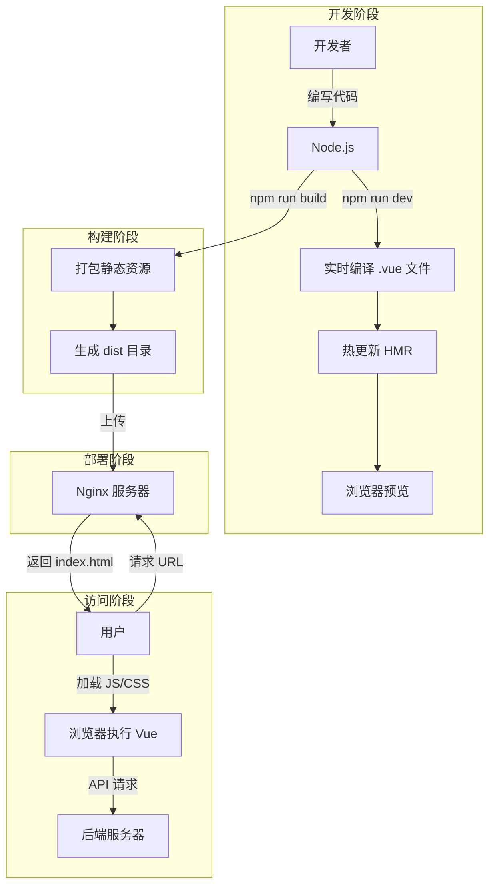

## 问：Vue 项目中 Node.js、Nginx、浏览器的关系

## Deepseek:

理解 Vue 项目中 **Node.js**、**Nginx** 和 **浏览器** 三者的关系，关键在于区分它们在开发、构建和运行阶段的角色分工。以下是清晰的逻辑梳理：

---

### 一、核心角色职责对比
| **角色**    | **定位**           | **核心职责**                                              | **生命周期阶段**    |
| ----------- | ------------------ | --------------------------------------------------------- | ------------------- |
| **Node.js** | **开发/构建引擎**  | 提供开发环境、编译源码、打包代码                          | 开发阶段 + 构建阶段 |
| **Nginx**   | **生产环境快递员** | 高效分发静态资源（HTML/JS/CSS/图片）                      | 生产部署阶段        |
| **浏览器**  | **最终执行者**     | 下载资源、解析 HTML/CSS、执行 JS、渲染页面、运行 Vue 应用 | 用户访问阶段        |

---

### 二、工作流程中的协作关系
#### 场景：从开发到用户访问全流程


---

### 三、详细交互解析
#### 1. **Node.js 的角色（开发/构建阶段）**
- **为什么需要它？**  
  - `.vue`/`TS`/`Sass` 等非标准文件需编译为浏览器可读的 JS/CSS
  - 开发时需实时编译、热更新、调试工具
- **典型操作**：
  ```bash
  npm run dev    # 启动开发服务器（Node.js 进程）
  npm run build  # 打包代码（Node.js 调用 Webpack/Vite）
  ```
- **输出**：  
  生成 `dist` 目录（含纯静态文件 `index.html`, `app.js`, `app.css`）

#### 2. **Nginx 的角色（生产部署阶段）**
- **为什么需要它？**  
  - Node.js 开发服务器**不适合高并发生产环境**
  - Nginx 专精于**高效分发静态文件**（C 编写，性能碾压 Node.js）
- **核心配置**（示例）：
  ```nginx
  server {
      listen 80;
      root /var/www/vue-app/dist; # 指向打包后的目录
  
      # 所有路径返回 index.html（支持 Vue Router 的 history 模式）
      location / {
          try_files $uri $uri/ /index.html;
      }
  
      # 缓存优化（JS/CSS 文件缓存 1 年）
      location ~* \.(js|css)$ {
          expires 365d;
      }
  }
  ```
- **工作原则**：  
  **不执行 JS**！只按 URL 返回对应文件（如 `/js/app.js` → 返回文件内容）

#### 3. **浏览器的角色（用户访问阶段）**
- **关键动作**：
  1. 下载 `index.html`
  2. 解析到 `<script src="/js/app.js">` → 下载 JS 文件
  3. **执行 JS 代码**（包括 Vue 框架）
  4. 运行 `createApp().mount('#app')` → 渲染页面
  5. 发起 API 请求获取动态数据（与后端交互）
- **特殊能力**：
  - 内置 **JavaScript 引擎**（V8/SpiderMonkey）直接执行打包后的 JS
  - 无需理解 `.vue` 文件（已编译为标准 JS）

---

### 四、三者的依赖关系
| **交互场景**         | Node.js | Nginx | 浏览器 | 说明                                       |
| -------------------- | ------- | ----- | ------ | ------------------------------------------ |
| 开发时热更新         | ✅       | ❌     | ✅      | Node.js 服务 ↔ 浏览器                      |
| 打包构建 `dist` 目录 | ✅       | ❌     | ❌      | 纯 Node.js 操作                            |
| 用户访问生产环境     | ❌       | ✅     | ✅      | Nginx 服务 ↔ 浏览器                        |
| 执行 Vue 组件逻辑    | ❌       | ❌     | ✅      | 100% 在浏览器中完成                        |
| 提供 API 数据        | ❌       | ❌     | ✅      | 浏览器 → 独立后端（可能是 Node.js 或其他） |

> 💡 **关键结论**：  
> - **Node.js 只在开发和构建阶段介入**（生成浏览器能吃的“食物”）  
> - **Nginx 是生产环境的搬运工**（只负责送“食物”到浏览器）  
> - **浏览器是最终消费者**（消化并执行所有代码）

---

### 五、常见误区澄清
1. **误区**：生产环境需要 Node.js 运行 Vue  
   **真相**：打包后的 Vue 是纯静态文件，由浏览器直接执行，**无需 Node.js 支持**。

2. **误区**：Nginx 能处理 Vue 逻辑  
   **真相**：Nginx **只返回文件内容**，不解析 JS 或执行 Vue 组件。

3. **误区**：浏览器能直接读 `.vue` 文件  
   **真相**：浏览器只能运行标准 JS，`.vue` 文件需提前编译（Node.js 的职责）。

---

### 六、协作关系图示


```
graph LR
    A[Node.js] -->|① 开发阶段| B[提供实时编译/HMR]
    A -->|② 构建阶段| C[生成 dist 静态文件]
    C --> D[Nginx]
    D -->|③ 分发文件| E[浏览器]
    E -->|④ 执行 JS| F[运行 Vue 应用]
    F -->|⑤ API 请求| G[后端服务器]
    G -->|返回数据| F

    style A fill:#90c53f,stroke:#333
    style D fill:#e87040,stroke:#333
    style E fill:#4dabf7,stroke:#333
```

> **箭头解读**：  
> ① Node.js 服务开发者 → ② Node.js 生成产物 → ③ Nginx 服务用户 → ④ 浏览器执行一切 → ⑤ 与后端解耦

## GPT:

这个问题非常关键，它能帮助你彻底理解前端项目的**开发 → 打包 → 部署 → 运行**全流程。

我们来详细讲清楚：

------

## ✅ 一句话总结：

> **Node.js 负责开发和构建，Nginx 负责部署和服务，浏览器负责最终运行。**

它们三者各有职责，构成了一个完整的前端应用生命周期。

------

## 🧭 Vue 项目开发到上线的完整流程图

```
[开发者电脑]
  👨‍💻 使用 Node.js + npm + Vite/Webpack 开发 Vue 项目
     ⬇️ npm run build
  📦 输出打包文件 dist/

             ↓（上传到服务器）

[生产服务器]
  🧱 用 Nginx 作为静态服务器，部署 dist/ 文件夹
     ⬇️ 等待用户访问

[用户浏览器]
  🌐 输入网址访问网站
     ⬇️ 向 Nginx 发起 HTTP 请求
     ⬇️ 加载 dist/index.html + JS/CSS
  🚀 浏览器运行页面，展示最终内容
```

------

## 🔍 分别讲清楚三者职责

------

### 🟧 1. Node.js：开发 & 打包阶段使用

| 用途               | 说明                                     |
| ------------------ | ---------------------------------------- |
| 运行构建工具       | 如 `vite`、`webpack`，它们是基于 Node 的 |
| 启动本地开发服务器 | `npm run dev` 就是用 Node 起的调试服务   |
| 编译 Vue 文件      | `.vue` 文件浏览器不能识别，必须编译成 JS |
| 打包生产文件       | `npm run build` 输出 `/dist` 文件夹      |

📌 **上线之后，Node.js 可以不再使用**，除非你也用 Node 写后端（比如用 Express/NestJS 提供 API）。

------

### 🟩 2. Nginx：上线部署阶段使用

| 用途           | 说明                                                         |
| -------------- | ------------------------------------------------------------ |
| 静态资源服务器 | 用来托管 Vue 项目打包后的静态文件（HTML/CSS/JS）             |
| 处理用户请求   | 浏览器访问 `http://yourdomain.com`，Nginx 找到 `index.html` 返回 |
| 路由转发       | Vue 使用前端路由，Nginx 配置 `try_files` 支持 SPA            |
| 也可反向代理   | 如果你后端用 Node.js API，也可以 Nginx 代理转发给 Node 服务  |

✅ Nginx 是部署静态网页的**最佳搭档**，高效、稳定、轻量。

------

### 🟦 3. 浏览器：运行阶段使用

| 用途          | 说明                                                         |
| ------------- | ------------------------------------------------------------ |
| 请求页面资源  | 输入网址后，浏览器发起对 `index.html` 和 `.js`、`.css` 的 HTTP 请求 |
| 运行前端应用  | 加载 JS 脚本（包含 Vue 逻辑），渲染页面                      |
| 发起 API 请求 | Vue 中可能调用后端接口，向服务器发送 Ajax 请求               |
| 渲染动态交互  | 组件加载、动画、点击响应等都在浏览器内执行                   |

📌 **Vue 是运行在浏览器中的框架**，打包后完全由浏览器执行，无需依赖 Node.js。

------

## 🧠 举个通俗比喻

把整个流程比作“写书 → 印刷 → 阅读”：

| 阶段     | 比喻             | 技术组件                    |
| -------- | ---------------- | --------------------------- |
| 写稿     | 使用 Word 写内容 | 开发阶段 + Node.js 构建工具 |
| 印刷     | 打印成书         | 打包成 dist 静态文件        |
| 发货上架 | 把书送到书店     | 用 Nginx 发布上线           |
| 阅读     | 读者打开书阅读   | 浏览器加载运行 Vue 应用     |

------

## ✅ 总结对比表

| 项目                 | Node.js                    | Nginx          | 浏览器                 |
| -------------------- | -------------------------- | -------------- | ---------------------- |
| 是否运行在开发者电脑 | ✅ 是                       | ❌ 否           | ✅ 是                   |
| 是否部署到服务器     | ❌ 一般不部署（除非做后端） | ✅ 是           | ❌ 否                   |
| 是否提供前端页面     | ❌ 否                       | ✅ 提供静态页面 | ✅ 加载并运行页面       |
| 是否运行 Vue 代码    | ❌ 只负责编译               | ❌ 只托管文件   | ✅ 真正运行 Vue         |
| 是否必须安装         | ✅ 本地开发需要安装         | ✅ 部署阶段安装 | ❌ 浏览器自带，无需安装 |

------

## ✅ 常见组合方式

- 💻 **开发阶段**：
  - Node.js + npm + Vite/Webpack
- 🚀 **上线部署阶段**：
  - 打包后的 `/dist` + Nginx 静态服务器
- 🌍 **运行阶段**：
  - 浏览器加载并运行页面，执行 Vue

------

如果你还想了解：

- 如何自己搭建一个 Nginx 本地服务器部署 Vue 项目？
- 如何同时部署后端 API 和前端页面？
- 怎么通过 Nginx 做 Vue + 后端接口的转发代理？

我可以给你一个具体部署示例（含配置）。需要的话直接说一声~

