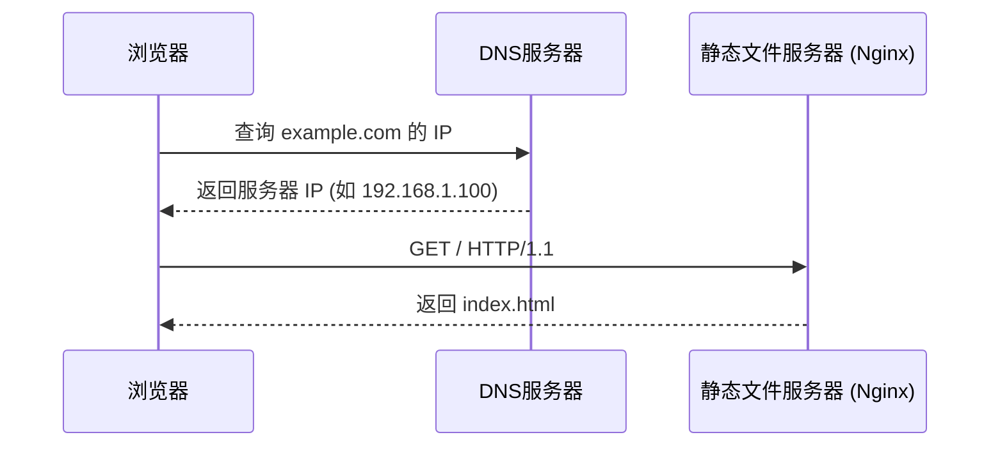
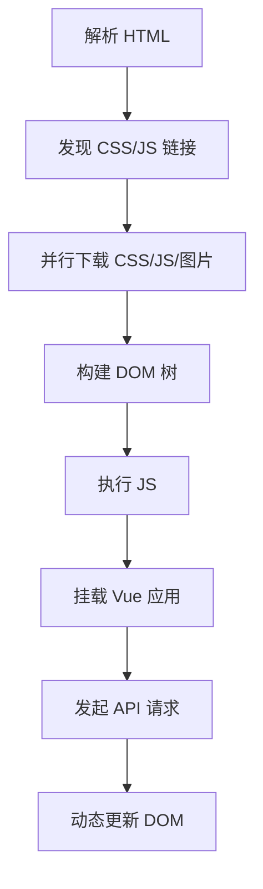
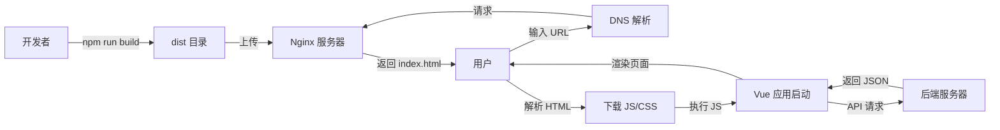

## 问：Vue项目打包后的文件如何从服务器传到浏览器执行？

## Deepseek:

打包后的文件从服务器传输到浏览器并执行的过程，是一个典型的 HTTP 请求-响应流程，涉及网络协议、服务器处理、浏览器渲染等多个环节。以下是详细步骤分解：

---

### 一、部署阶段：静态文件准备
1. **打包生成静态资源**  
   `npm run build` 生成 `dist`` 目录，包含：
   - `index.html`：入口 HTML 文件
   - `*.js`：压缩合并的 JavaScript 文件（含 Vue 框架、业务代码）
   - `*.css`：压缩后的样式文件
   - `assets/`：图片/字体等资源

2. **上传至服务器**  
   将 `dist` 目录部署到静态服务器（如 Nginx/Apache/CDN/云存储）的指定路径（如 `/var/www/my-app`）。

---

### 二、浏览器请求阶段：HTTP 协议交互
#### 当用户访问 `https://example.com` 时：


1. **DNS 解析**  
   浏览器通过 DNS 将域名解析为服务器 IP 地址。

2. **建立 TCP 连接**  
   浏览器与服务器通过 TCP 三次握手建立连接（HTTPS 还需 TLS 握手）。

3. **发送 HTTP 请求**  
   浏览器发送请求：  
   ```http
   GET / HTTP/1.1
   Host: example.com
   Accept: text/html
   ```

---

### 三、服务器响应阶段：静态文件分发
#### 服务器处理流程：


```
graph LR
A[收到 GET / 请求] --> B{路径是否存在？}
B -->|是| C[读取 /var/www/my-app/index.html]
B -->|否| D[返回 404]
C --> E[返回文件内容 + Content-Type: text/html]
```

1. **匹配请求路径**  
   Nginx 配置示例：
   ```nginx
   server {
       listen 80;
       root /var/www/my-app; # 静态文件根目录
       
       location / {
           try_files $uri $uri/ /index.html; # 路由重定向
       }
   }
   ```

2. **返回文件内容**  
   服务器直接读取硬盘上的 `index.html` 文件，无需任何计算，通过 HTTP 响应返回：
   ```http
   HTTP/1.1 200 OK
   Content-Type: text/html
   Content-Length: 1024
   
   <!DOCTYPE html>
   <html>
     <head>
       <link href="/css/app.7a3b9.css" rel="stylesheet">
     </head>
     <body>
       <div id="app"></div>
       <script src="/js/chunk-vendors.8c1a2.js"></script>
       <script src="/js/app.04e5f.js"></script>
     </body>
   </html>
   ```

---

### 四、浏览器解析执行阶段：渲染 Vue 应用
#### 浏览器处理流程：


1. **解析 HTML 构建 DOM**  
   - 遇到 `<link rel="stylesheet">` → **下载 CSS 文件** → 构建 CSSOM（样式树）
   - 遇到 `<script src="...">` → **下载 JS 文件** → 暂停 HTML 解析（除非标记 `async/defer`）

2. **执行 JavaScript 代码**  
   - 浏览器执行 `/js/app.04e5f.js` 中的代码：
     ```js
     import { createApp } from 'vue'
     import App from './App.vue' // 已编译为 JS 对象
     
     createApp(App).mount('#app') // 挂载到 <div id="app">
     ```
   - Vue 启动后：
     - 初始化响应式系统
     - 编译模板为虚拟 DOM 渲染函数
     - 将组件渲染到页面

3. **加载动态资源**  
   - 若组件需要图片等资源，浏览器发起额外请求：
     ```http
     GET /assets/logo.d026a.svg HTTP/1.1
     Host: example.com
     ```

4. **API 数据交互**  
   - 组件通过 `fetch` 或 `axios` 请求后端 API：
     ```js
     // 浏览器发起 API 请求（与静态资源分离）
     fetch('https://api.example.com/data')
       .then(res => res.json())
       .then(data => {
         // 更新 Vue 组件状态
       })
     ```

---

### 五、关键角色分工
| **角色**       | 职责                                                         |
| -------------- | ------------------------------------------------------------ |
| **静态服务器** | 机械式分发文件（不执行 JS/Vue 代码）                         |
| **浏览器**     | 下载文件 + 解析 HTML/CSS + 执行 JS + 运行 Vue 应用 + 发起 API 请求 |
| **API 服务器** | 处理动态数据请求（独立于静态资源服务器）                     |
| **Vue 框架**   | 在浏览器中管理组件状态、渲染视图、处理交互                   |

---

### 六、为什么整个过程无需 Node.js？
1. **静态文件服务器**  
   Nginx/Apache/CDN 用 C 编写，直接读取文件系统，**不需要 JS 运行时**。

2. **浏览器执行环境**  
   Chrome/Firefox/Safari 内置 **JavaScript 引擎（V8/SpiderMonkey/JavaScriptCore）**，可独立运行 Vue 编译后的 JS 代码。

3. **API 服务器分离**  
   后端服务（如 Node.js/Java/Python）仅提供数据接口，与前端资源物理隔离。

---

### 总结：从服务器到浏览器的完整旅程


**核心要点**：  
1. 静态服务器只做**文件分发**（邮差送包裹）  
2. 浏览器是**执行引擎**（拆包裹、组装产品、打电话订购配件）  
3. Vue 应用在浏览器中**完全独立运行**

## GPT:

这个问题问得非常好！
 它关乎你对“前端部署”和“浏览器是如何加载页面”的**整个执行过程**的理解。我们来**图解 + 分步骤讲清楚：**

------

## ✅ 一句话总结：

> **Vue 打包后的文件（HTML/JS/CSS）是通过 HTTP 协议，从 Web 服务器（如 Nginx）传输给浏览器，由浏览器解析执行的。**

------

## 🧭 流程总览图

```
【用户浏览器】
     ⬇️ 输入网址
http://example.com
     ⬇️
[HTTP 请求] → → → → → → → →
                  【Web 服务器（Nginx）】
                     找到 dist/index.html
                  ← ← ← ← ← ← ← ← 
                 [HTTP 响应] 返回 index.html
     ⬇️
浏览器收到 index.html，开始解析
     ⬇️
根据 HTML 中的 <script> 和 <link> 发起新请求：
    ⬇️              ⬇️
请求 app.[hash].js  请求 style.[hash].css
     ⬇️              ⬇️
服务器返回 JS/CSS 文件
     ⬇️
浏览器运行 JS、加载 CSS，页面显示完成
```

------

## 🪜 分步骤详细讲解

### **1. 用户访问网站**

用户在浏览器地址栏输入：

```
http://example.com
```

浏览器发起一个 HTTP 请求：

```
GET / HTTP/1.1
Host: example.com
```

------

### **2. Web 服务器收到请求（如 Nginx）**

Nginx 根据配置，找到 Vue 打包生成的 `dist/index.html` 文件，并返回它：

```
HTTP/1.1 200 OK
Content-Type: text/html

<!DOCTYPE html>
<html>
  <head>
    <link href="/assets/style.abc123.css" rel="stylesheet" />
  </head>
  <body>
    <div id="app"></div>
    <script src="/assets/app.def456.js"></script>
  </body>
</html>
```

------

### **3. 浏览器开始加载资源**

浏览器一边解析 HTML，一边发现：

- 有一个 CSS：`/assets/style.abc123.css`
- 有一个 JS：`/assets/app.def456.js`

于是它又发出两个 HTTP 请求：

```
GET /assets/style.abc123.css
GET /assets/app.def456.js
```

------

### **4. 服务器返回 CSS 和 JS 文件**

服务器继续查找 `/dist/assets/` 下的这些文件，把它们原样返回。

------

### **5. 浏览器解析和执行**

浏览器拿到文件后：

- 把 CSS 加入页面样式
- 执行 JS 代码（这些 JS 就是 Vue 项目打包后的结果，负责渲染页面、注册组件、加载数据等）

最终用户看到的页面就完整呈现出来了。

------

## 📁 打包后目录结构长什么样？

```bash
dist/
├── index.html
└── assets/
    ├── app.def456.js
    └── style.abc123.css
```

这是 Vue 的产物，是**纯静态资源**，浏览器通过 HTTP 就能访问和运行。

------

## 📌 关键概念回顾

| 概念         | 含义                                    |
| ------------ | --------------------------------------- |
| 打包后的文件 | 是 HTML/CSS/JS 文件，浏览器能直接识别   |
| Web 服务器   | 如 Nginx，它把文件从硬盘“发给”浏览器    |
| HTTP 协议    | 浏览器与服务器之间通信的标准协议        |
| 浏览器行为   | 会根据 HTML 自动请求其它资源，如 CSS/JS |

------

## ✅ 小结：Vue 打包文件是怎么从服务器传到浏览器？

| 步骤                    | 说明                     |
| ----------------------- | ------------------------ |
| ① 浏览器访问网站        | 发出对 index.html 的请求 |
| ② 服务器返回 HTML 文件  | 比如 dist/index.html     |
| ③ 浏览器发现需要 JS/CSS | 发出额外的 HTTP 请求     |
| ④ 服务器返回这些文件    | 如 app.js、style.css     |
| ⑤ 浏览器执行这些资源    | 页面就展示出来了         |

------

如果你想亲手实践，可以让我教你用 Nginx 搭一个本地服务器，把打包后的 Vue 项目部署运行起来，你就能看到整个过程！要不要试试？😊