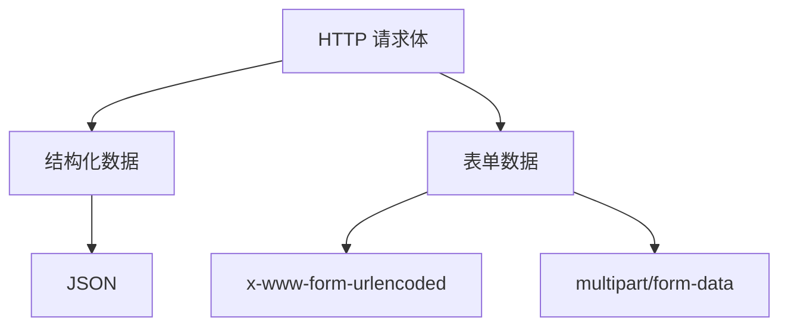

## 问：不同类型的请求体（如 JSON、FormData、x-www-form-urlencoded）之间的关系或区别？

下面我详细解释三种常见请求体类型（JSON、FormData、x-www-form-urlencoded）的区别和关系，帮助你彻底理解它们的本质差异和使用场景：

---

### **核心区别三维度**
| 维度                  | JSON               | x-www-form-urlencoded               | FormData (multipart/form-data) |
| --------------------- | ------------------ | ----------------------------------- | ------------------------------ |
| **数据结构**          | 支持复杂嵌套结构   | 扁平键值对                          | 支持键值对+二进制文件          |
| **编码方式**          | 原生数据结构       | URL 编码键值对                      | 多部分边界分隔                 |
| **典型 Content-Type** | `application/json` | `application/x-www-form-urlencoded` | `multipart/form-data`          |
| **文件支持**          | ❌ (需 Base64 编码) | ❌                                   | ✅ 原生支持                     |
| **数据大小限制**      | 无理论限制         | 约 2000 字符 (URL 限制)             | 无理论限制                     |
| **可读性**            | 优 (结构化)        | 中 (需解码)                         | 差 (二进制混杂)                |

---

### **深入解析每种类型**

#### 1. JSON (application/json)
- **本质**：JavaScript 对象表示法的纯文本
- **数据结构**：
  ```json
  {
    "user": {
      "name": "小明",
      "age": 25,
      "hobbies": ["编程", "摄影"],
      "meta": {"vip": true}
    }
  }
  ```
- **特点**：
  - ✅ 支持无限嵌套的复杂结构
  - ✅ 原生表示数组、布尔值等数据类型
  - ❌ 不适合传输二进制文件（需 Base64 编码）
- **FastAPI 处理**：
  ```python
  # 自动映射到 Pydantic 模型
  class User(BaseModel):
      name: str
      age: int
      hobbies: list[str]
      
  @app.post("/users")
  def create_user(user: User):  # 自动解析 JSON
  ```

#### 2. x-www-form-urlencoded
- **本质**：URL 查询字符串格式的请求体
- **数据结构**：
  ```
  name=%E5%B0%8F%E6%98%8E&age=25&hobbies=%E7%BC%96%E7%A8%8B&hobbies=%E6%91%84%E5%BD%B1
  ```
  ↓ 解码后 ↓  
  `name=小明&age=25&hobbies=编程&hobbies=摄影`
- **特点**：
  - ✅ 浏览器表单默认提交格式
  - ❌ 所有值都是字符串（需手动类型转换）
  - ❌ 不支持嵌套结构（多值用重复键表示）
  - ⚠️ 特殊字符需 URL 编码（如空格变 `+`，中文变 `%E4%B8%AD`）
- **FastAPI 处理**：
  ```python
  @app.post("/login")
  def login(
      username: str = Form(...),  # 显式声明 Form
      password: str = Form(...)
  ):
  ```

#### 3. FormData (multipart/form-data)
- **本质**：多部分混合数据流（文本+文件）
- **数据结构**：
  ```
  --boundary123
  Content-Disposition: form-data; name="name"
  
  小明
  --boundary123
  Content-Disposition: form-data; name="avatar"; filename="face.jpg"
  Content-Type: image/jpeg
  
  [图片二进制数据]
  --boundary123--
  ```
- **特点**：
  - ✅ 唯一原生支持文件上传的格式
  - ✅ 每个字段有独立元数据（文件名、类型）
  - ⚠️ 格式复杂（需要边界分隔符）
  - ⚠️ 数据体积较大（有边界开销）
- **FastAPI 处理**：
  ```python
  @app.post("/upload")
  def upload(
      name: str = Form(...),
      avatar: UploadFile = File(...)  # 特殊文件类型
  ):
  ```

---

### **关键关系与转换**

#### 1. 层级关系


#### 2. 互相转换场景
- **JSON → FormData**  
  前端：`const formData = new FormData(); formData.append('json', JSON.stringify(data))`  
  后端：解析后手动 `json.loads()`

- **FormData → JSON**  
  限制：文件需 Base64 编码，失去流式传输优势
  ```json
  {
    "text_field": "value",
    "file_field": "data:image/jpeg;base64,/9j/4AAQSkZJRg..."
  }
  ```

- **x-www-form-urlencoded → JSON**  
  自动转换（FastAPI 内置）：
  ```python
  # 接收 ?name=小明&age=25
  def endpoint(name: str, age: int):  # 自动转换类型
  ```

---

### **使用场景决策树**


#### 场景示例：
1. **用户注册**  
   - 简单文本 → `x-www-form-urlencoded`  
   - 含头像 → `multipart/form-data`  
   - 含地址等复杂信息 → `JSON`

2. **API 数据交互**  
   移动端/前端框架 → 首选 `JSON`

3. **文件导入服务**  
   Excel/图片上传 → 必须用 `multipart/form-data`

---

### **FastAPI 的智能处理**
1. **自动类型转换**  
   ```python
   # 即使表单提交，也能转换类型
   def submit(age: int = Form(...)):  # 字符串"25" → 整数25
   ```

2. **混合参数识别**  
   ```python
   @app.post("/{version}/update")
   def update(
       version: str,                  # 自动识别为 Path
       id: int = Query(...),           # 查询参数
       data: dict = Body(...),         # JSON 主体
       file: UploadFile = File(None)   # 可选文件
   ):
   ```
   此时要求 `Content-Type: multipart/form-data`

3. **错误处理**  
   发送 JSON 到声明 Form 的端点 → 自动返回 422 错误：
   ```json
   {
     "detail": "Expected form data"
   }
   ```

---

### **总结：核心选择原则**
1. **首选 JSON**  
   - 前后端分离架构
   - 需要复杂数据结构
   - API-to-API 通信

2. **必选 FormData 当**  
   - 需要上传文件
   - 混合文本+二进制数据

3. **考虑 x-www-form-urlencoded 当**  
   - 传统浏览器表单提交
   - 简单键值对数据
   - 需要兼容旧系统

> 📌 **黄金法则**：  
> **前端框架 → JSON | 文件上传 → FormData | 传统表单 → urlencoded**

理解这些差异后，你就能根据实际需求精准选择数据编码方式，避免常见的「为什么后端收不到数据」的问题。