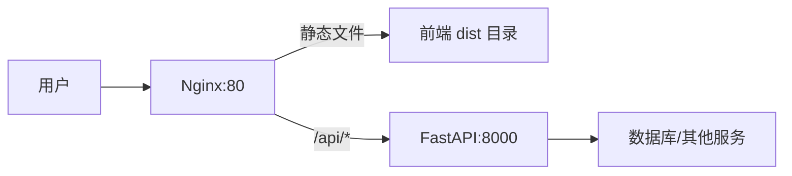
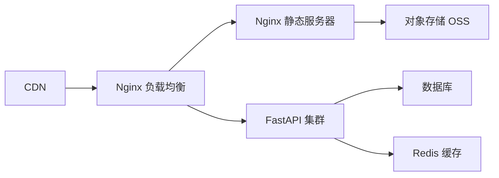

## 问：如何同时部署Fastapi后端 API 和前端页面？

## Deepseek:

要同时部署 FastAPI 后端 API 和 Vue 前端页面，推荐使用 **Nginx 作为反向代理** 的组合方案。以下是详细步骤和最佳实践：

---

### 一、架构设计


- **Nginx**：统一入口，处理静态文件 + 反向代理 API
- **前端**：Vue 打包后的静态文件（`dist` 目录）
- **后端**：FastAPI 运行在 ASGI 服务器（Uvicorn）

---

### 二、部署步骤

#### 1. 准备项目结构（服务器上）
```bash
/var/www/myapp/
├── frontend/       # Vue 项目
│   ├── dist/       # npm run build 生成
├── backend/        # FastAPI 项目
│   ├── main.py     # FastAPI 入口文件
│   ├── requirements.txt
```

#### 2. 前端部署
```bash
# 在 Vue 项目中
npm run build  # 生成 dist 目录

# 复制到服务器
scp -r dist user@server:/var/www/myapp/frontend/
```

#### 3. 后端部署
```bash
# 进入后端目录
cd /var/www/myapp/backend

# 创建虚拟环境
python -m venv venv
source venv/bin/activate

# 安装依赖
pip install -r requirements.txt fastapi uvicorn

# 测试运行
uvicorn main:app --host 0.0.0.0 --port 8000
```

#### 4. 配置 Nginx（关键）
```nginx
# /etc/nginx/sites-available/myapp
server {
    listen 80;
    server_name yourdomain.com;  # 或 IP 地址
    
    # 前端静态文件服务
    location / {
        root /var/www/myapp/frontend/dist;
        try_files $uri $uri/ /index.html;  # Vue Router history 模式支持
        expires 30d;  # 缓存优化
    }
    
    # 反向代理 API 请求
    location /api {
        proxy_pass http://localhost:8000;  # 转发到 FastAPI
        
        # 关键请求头设置
        proxy_set_header Host $host;
        proxy_set_header X-Real-IP $remote_addr;
        proxy_set_header X-Forwarded-For $proxy_add_x_forwarded_for;
        proxy_set_header X-Forwarded-Proto $scheme;
    }
    
    # 防止爬虫访问 API 文档
    location /docs {
        return 403;
    }
}
```
启用配置：
```bash
sudo ln -s /etc/nginx/sites-available/myapp /etc/nginx/sites-enabled/
sudo nginx -t && sudo systemctl reload nginx
```

#### 5. 持久化运行后端（使用 systemd）
创建服务文件 `/etc/systemd/system/myapp.service`：
```ini
[Unit]
Description=FastAPI MyApp
After=network.target

[Service]
User=ubuntu
WorkingDirectory=/var/www/myapp/backend
Environment="PATH=/var/www/myapp/backend/venv/bin"
ExecStart=/var/www/myapp/backend/venv/bin/uvicorn main:app --host 0.0.0.0 --port 8000

[Install]
WantedBy=multi-user.target
```
启动服务：
```bash
sudo systemctl daemon-reload
sudo systemctl start myapp
sudo systemctl enable myapp  # 开机自启
```

---

### 三、配置优化技巧

#### 1. 跨域解决方案（二选一）
**方案A：Nginx 统一域名**（推荐）
```nginx
location /api {
    proxy_pass http://localhost:8000;
    # 添加跨域头
    add_header 'Access-Control-Allow-Origin' 'https://yourdomain.com';
    add_header 'Access-Control-Allow-Methods' 'GET, POST, OPTIONS';
    add_header 'Access-Control-Allow-Headers' 'DNT,User-Agent,X-Requested-With,Content-Type';
}
```

**方案B：FastAPI CORS 中间件**
```python
# main.py
from fastapi.middleware.cors import CORSMiddleware

app = FastAPI()

app.add_middleware(
    CORSMiddleware,
    allow_origins=["https://yourdomain.com"],
    allow_methods=["*"],
    allow_headers=["*"],
)
```

#### 2. 静态文件压缩（Nginx）
```nginx
gzip on;
gzip_types text/plain text/css application/json application/javascript;
gzip_min_length 1000;
```

#### 3. HTTPS 配置
使用 Let's Encrypt 免费证书：
```bash
sudo apt install certbot python3-certbot-nginx
sudo certbot --nginx -d yourdomain.com
```

---

### 四、验证部署

1. **前端访问**  
   `https://yourdomain.com` → 应显示 Vue 应用

2. **API 测试**  
   ```bash
   curl https://yourdomain.com/api/healthcheck
   # 应返回 FastAPI 响应
   ```

3. **日志检查**  
   ```bash
   # Nginx 日志
   tail -f /var/log/nginx/access.log
   
   # FastAPI 日志
   journalctl -u myapp -f
   ```

---

### 五、备选方案：FastAPI 托管静态文件

适合小型项目（不推荐生产环境）：
```python
from fastapi.staticfiles import StaticFiles
from fastapi import FastAPI

app = FastAPI()

# 先挂载 API 路由
@app.get("/api/items")
async def read_items():
    return [{"name": "Item1"}]

# 最后挂载静态文件
app.mount("/", StaticFiles(directory="frontend/dist", html=True))
```
运行：
```bash
uvicorn main:app --host 0.0.0.0 --port 8000
```

> ⚠️ 缺点：  
> - 静态文件性能不如 Nginx  
> - 无法有效利用缓存  
> - 高并发时影响 API 性能

---

### 六、生产环境推荐架构


关键优化：
1. 前端静态文件托管到 CDN + 对象存储
2. 使用多个 Uvicorn worker（`--workers 4`）
3. 后端添加 Redis 缓存层
4. 数据库连接池配置

通过这种部署方式，你可以获得：
- 前端高性能静态资源服务
- 后端 API 的弹性扩展能力
- 统一的访问入口和安全管理
- 专业级的性能优化能力

## GPT:

非常棒的问题！

你已经掌握了前后端分离的基本概念，现在我们来教你：**如何将前端 Vue 页面 和 FastAPI 后端 API 一起部署到一台服务器上**，即：

> ✅ **前端 Vue 打包成静态文件，由 FastAPI 负责同时提供前端页面和后端 API**

------

## 🧭 部署目标

```
🌐 用户访问 http://yourdomain.com
 ├── GET /             → 返回 Vue 打包后的 index.html
 ├── GET /assets/...   → 返回 Vue 的 JS/CSS 等资源
 └── GET /api/...      → 调用 FastAPI 提供的后端接口
```

------

## ✅ 步骤概览

1. 📦 打包前端 Vue 项目
2. 📁 把打包后的静态文件放到 FastAPI 项目中
3. 🧩 FastAPI 配置静态文件和前端入口
4. 🚀 启动 FastAPI，前后端一起服务！

------

## 📦 第一步：打包 Vue 项目

在你的 Vue 项目目录下运行：

```bash
npm run build
```

会生成一个 `dist/` 目录，里面是：

```
dist/
  ├── index.html
  └── assets/
       ├── app.js
       └── style.css
```

------

## 📁 第二步：将打包好的文件复制到 FastAPI 项目中

FastAPI 项目结构可以是这样：

```
my_fastapi_project/
├── main.py
├── static/        👈 存放 Vue 的打包文件（复制 dist/ 的内容）
│   ├── index.html
│   └── assets/
└── ...
```

------

## 🧩 第三步：FastAPI 设置静态文件 & SPA 路由

```python
from fastapi import FastAPI, Request
from fastapi.responses import FileResponse
from fastapi.staticfiles import StaticFiles
import os

app = FastAPI()

# 👇 挂载静态资源目录（前端 CSS/JS）
app.mount("/assets", StaticFiles(directory="static/assets"), name="assets")

# 👇 定义后端 API 示例
@app.get("/api/hello")
def hello():
    return {"message": "Hello from FastAPI!"}

# 👇 处理前端入口（Vue SPA 所有路径都回到 index.html）
@app.get("/{full_path:path}")
async def serve_vue_app(full_path: str):
    index_path = os.path.join("static", "index.html")
    return FileResponse(index_path)
```

------

## 🧪 第四步：启动 FastAPI 服务

```bash
uvicorn main:app --reload --host 0.0.0.0 --port 8000
```

现在：

- 访问 `http://localhost:8000/` 👉 会看到你的 Vue 页面
- 调用 `http://localhost:8000/api/hello` 👉 FastAPI 接口返回 JSON

------

## ✅ 请求路由说明

| 路径          | FastAPI 响应                      |
| ------------- | --------------------------------- |
| `/`           | 返回 index.html                   |
| `/about`      | 返回 index.html（让前端路由接管） |
| `/assets/...` | 返回对应的 JS/CSS 文件            |
| `/api/...`    | 返回 FastAPI 的 API 数据          |

------

## 🧠 小技巧：前端请求 API 时使用 `/api/` 前缀

你在 Vue 中请求 API 时应该写成：

```js
axios.get('/api/hello')
```

否则前端会默认去请求静态文件路径。

------

## 🧰 补充（部署到线上）

上线时你可以用：

- `gunicorn + uvicorn workers` 启动后端
- 用 `nginx` 做一层反向代理：

```nginx
server {
  listen 80;
  server_name yourdomain.com;

  location / {
    proxy_pass http://127.0.0.1:8000;
  }
}
```

------

## ✅ 总结一句话：

> 把打包后的 Vue 静态资源放到 FastAPI 项目中，FastAPI 用 `StaticFiles` 和 `FileResponse` 提供前端页面，再继续提供 API 接口即可。

------

如果你希望我直接给你生成一个完整的可运行示例工程目录结构（含代码），我也可以立刻帮你搭好，想要吗？