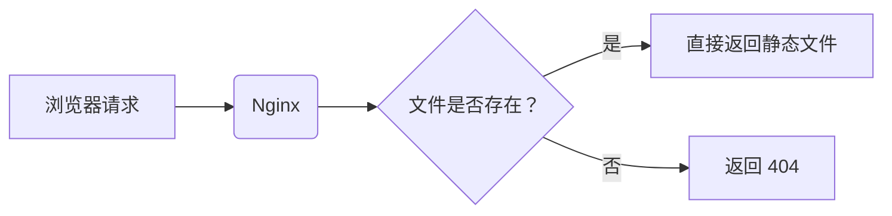

## 问：浏览器为什么不直接支持 Vue 文件？Node.js 和服务器环境的其他区别？

## Deepseek:

这两个问题问到了前端生态的核心设计理念，我们来深入拆解：

---

### **问题一：浏览器为什么不直接支持 `.vue` 文件？**

浏览器确实**无法直接解析 `.vue` 文件**，原因在于其设计定位和技术约束：

#### 1. **浏览器的核心职责是执行标准**
   - 浏览器引擎（如 V8、SpiderMonkey）只原生支持 **Web 标准三件套**：
     - **HTML**（定义结构）
     - **CSS**（定义样式）
     - **JavaScript**（定义逻辑与交互）
   - `.vue` 文件是 **Vue 生态的扩展格式**（非 Web 标准），包含 `<template>`, `<script>`, `<style>` 三个块，本质是一种**开发者友好的源码封装格式**，不是浏览器可执行格式。

#### 2. **`.vue` 文件需要编译为浏览器可执行代码**
   ```vue
   <!-- 示例：一个 .vue 文件 -->
   <template>
     <div>{{ message }}</div>
   </template>
   
   <script>
   export default {
     data() {
       return { message: "Hello Vue!" };
     }
   };
   </script>
   
   <style scoped>
   div { color: blue; }
   </style>
   ```
   - **编译过程**（由 `vue-loader` 或 `Vite` 在 Node.js 环境下完成）：
     - `<template>` → 编译为 **JavaScript 渲染函数**（生成 Virtual DOM）
     - `<script>` → 转为 **ES Module**（可被 Webpack/Vite 处理）
     - `<style>` → 通过 `PostCSS` 等工具转为 **纯 CSS**，并注入作用域（`scoped`）
   - **输出结果**：浏览器最终接收的是 **纯 JavaScript 和 CSS 文件**，不再包含 `.vue` 语法。

#### 3. **工程化需求**
   - **模块化**：浏览器原生 ES 模块（`<script type="module">`）不支持文件预处理器、样式隔离等高级特性。
   - **优化**：需要 Tree Shaking、代码分割、压缩等构建时优化（浏览器无法实时完成）。
   - **兼容性**：需将现代语法（TypeScript/ESNext）转译为 ES5 以兼容旧浏览器。

> ✅ **结论**：  
> `.vue` 文件是**开发阶段的源码格式**，需通过 Node.js 工具链编译为标准 JS/CSS。浏览器只需执行最终产物，无需理解 `.vue` 语法。

---

### **问题二：Node.js 开发服务器 vs 生产服务器（如 Nginx）的本质区别**

#### 1. **角色与职责**
| **Node.js 开发服务器**               | **生产服务器（如 Nginx）**            |
| ------------------------------------ | ------------------------------------- |
| 动态编译资源（实时转译 `.vue`/SASS） | 静态分发文件（直接返回 `.js`/`.css`） |
| 提供开发工具链（HMR、Source Map）    | 提供高性能文件传输                    |
| 运行于 Node.js 环境                  | 无需 Node.js（C 编写，独立进程）      |

#### 2. **工作流程对比**
**Node.js 开发服务器（`webpack-dev-server` / `Vite`）**  


**生产服务器（Nginx）**  


#### 3. **关键差异**
| **特性**       | Node.js 开发服务器           | Nginx 生产服务器         |
| -------------- | ---------------------------- | ------------------------ |
| **资源生成**   | 动态编译（每次请求可能不同） | 返回预构建的静态文件     |
| **性能目标**   | 开发体验优先（支持 HMR）     | 高并发、低延迟           |
| **资源消耗**   | 高 CPU（实时编译）           | 低 CPU（文件 I/O 为主）  |
| **扩展性**     | 不适合高并发                 | 轻松处理数千并发连接     |
| **运行时依赖** | 需 Node.js 环境              | 无依赖（独立二进制文件） |
| **安全性**     | 暴露源码路径、调试接口       | 可配置安全头、限流等策略 |

---

### **为什么生产环境不需要 Node.js？**
1. **静态资源已预编译**  
   `npm run build` 将一切（.vue / SASS / TypeScript）转为浏览器可直接运行的 JS/CSS。

2. **浏览器是最终执行环境**  
   Vue 应用启动后完全在浏览器沙箱中运行：
   ```js
   // 打包后的 app.js（浏览器直接执行）
   import { createApp } from 'vue';
   createApp(...).mount('#app');
   ```

3. **后端解耦**  
   动态数据通过 API 请求独立后端服务（可以是 Node.js/Java/Go/Python 等），与前端资源分离。

---

### **总结**
| **场景**     | 需要 Node.js 的原因            | 无需 Node.js 的原因               |
| ------------ | ------------------------------ | --------------------------------- |
| **开发阶段** | 编译源码、提供 HMR、开发服务器 | -                                 |
| **生产运行** | -                              | 资源已静态化，浏览器独立执行      |
| **生产部署** | -                              | 静态服务器（Nginx/CDN）仅分发文件 |

> 💡 简单说：  
> - **开发时**：Node.js 是“**翻译官+服务员**”（实时编译代码并提供服务）。  
> - **生产环境**：Nginx 是“**快递员**”（只负责发送已打包好的静态文件）。  
> - **浏览器**：是最终“**用户**”（拆开包裹直接使用内容）。

## GPT:

太好了！你现在的问题已经进入了前端开发的**深层逻辑**，回答这个问题可以帮你从“会用 Vue”走向“真正理解前端生态”。我们就来逐条讲清楚：

------

## ✅ 一、浏览器为什么不直接支持 `.vue` 文件？

### 🔍 `.vue` 文件本质是什么？

`.vue` 是一种 **单文件组件（SFC, Single File Component）格式**，它看起来像这样：

```vue
<template>
  <h1>{{ message }}</h1>
</template>

<script>
export default {
  data() {
    return { message: '你好 Vue！' };
  }
}
</script>

<style scoped>
h1 { color: red; }
</style>
```

这不是浏览器原生支持的内容，**浏览器只认识标准的 HTML/CSS/JS**，它对 `template`、`script`、`style` 三合一结构一无所知。

------

### 🚫 为什么不能直接加载？

浏览器运行的机制是：

- 只能加载 `.html` 页面
- 页面内可以加载 `.js` 脚本文件
- 脚本文件中必须是**标准 JavaScript**，不能出现 `<template>`、`export default`、`scoped style` 这些语法

`.vue` 文件需要：

1. **模板编译**（template → render 函数）
2. **JS 转换**（ESModule + Vue 特有语法 → 浏览器能理解的 JS）
3. **样式处理**（scoped、Sass、PostCSS…）

📌 这些步骤需要打包工具（如 Vite、Webpack）配合 Vue 编译器完成。

------

### ✅ 所以：`.vue` 是开发者专用语法，浏览器不能直接运行，必须先编译。

------

## ✅ 二、Node.js 和服务器环境的区别

这个问题非常值得深入理解！下面是它们的比较：

------

### 📦 Node.js 是一个“运行 JavaScript 的程序”

- 本质是一个基于 Chrome V8 的 JS 执行环境
- 用来写后端代码（比如 Express 服务器）
- 也被用于执行构建工具（Webpack/Vite/Rollup）
- 安装在开发者电脑或服务器上

你可以把它理解为：“Node.js = 浏览器里的 JS 引擎 + 文件/网络等能力”。

------

### 🌐 服务器环境：是网页对外提供服务的平台

通常由这些组成：

| 部分               | 描述                                                   |
| ------------------ | ------------------------------------------------------ |
| **Web 服务器**     | nginx、Apache、Caddy，用来接收请求并返回文件或转发请求 |
| **操作系统**       | Linux/Windows/macOS                                    |
| **服务端运行环境** | 可以是 PHP、Node.js、Python、Java 等                   |
| **部署工具**       | PM2、Docker、Nginx、GitLab CI 等                       |

📌 **Node.js 可以是服务器环境的一部分**，但服务器环境不仅仅是 Node。

------

### ✅ 举个例子：

| 项目             | 说明                                                         |
| ---------------- | ------------------------------------------------------------ |
| Vue + Vite 项目  | 本地开发时使用 Node.js（跑 dev server、打包）                |
| 打包后的文件部署 | 用 Nginx 静态托管 HTML/CSS/JS，不再需要 Node.js              |
| 后端接口服务     | 如果你用 Node.js（比如 Express、NestJS）开发 API，那就要部署 Node.js 后端 |

------

## ✅ 总结

| 对象                 | 浏览器支持？   | 是否可直接部署？            | 是否用于开发？     |
| -------------------- | -------------- | --------------------------- | ------------------ |
| `.vue` 文件          | ❌ 不支持       | ❌ 不可直接部署              | ✅ 是开发用格式     |
| HTML/CSS/JS          | ✅ 原生支持     | ✅ 可直接部署                | ✅ 也用于开发       |
| Node.js              | ❌ 浏览器不运行 | ✅ 可部署后端服务            | ✅ 必须用于构建阶段 |
| Vue 编译结果（dist） | ✅ 浏览器能运行 | ✅ 可托管在任何 Web 服务器上 | ❌ 不用于开发       |

------

如果你还不清楚：

- Vue 项目中 Node.js、Nginx、浏览器的关系
- 打包后的文件如何从服务器传到浏览器执行
- 如何手动搭建一个服务器部署 Vue 项目

我可以给你画一张流程图或帮你搭一次完整流程（含部署示例）。你想深入哪一块？